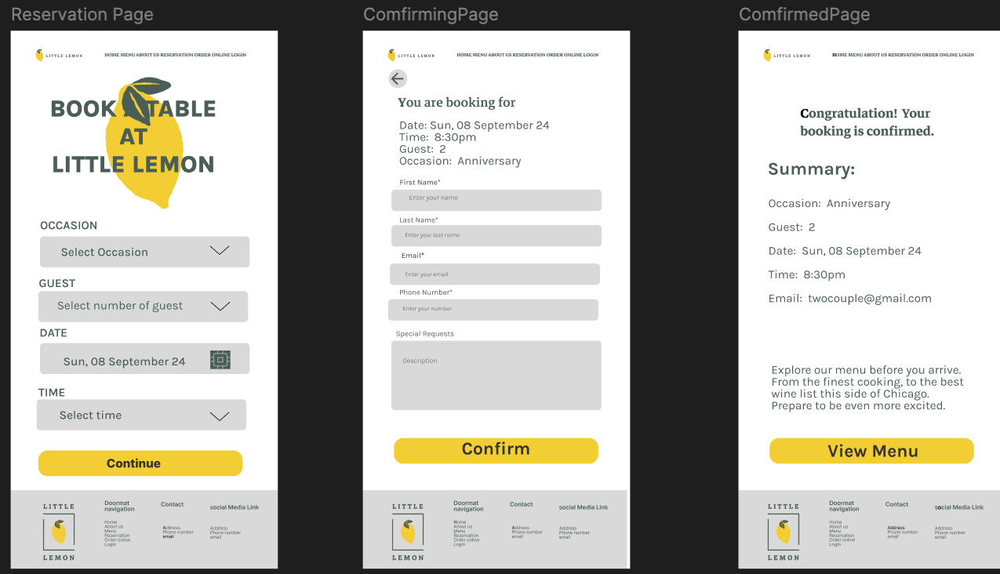

# Little Lemon Restaurant - Reserve a Table Feature

This project is part of the Meta Frontend Developer Professional Certificate. It focuses on adding a "Reserve a Table" feature to the Little Lemon Restaurant website. This feature allows customers to book a table online, entering the necessary details through an easy-to-use form.

## Project Overview

The Little Lemon restaurant website was enhanced by incorporating a table reservation feature. I designed the homepage and the reservation feature using Figma before implementing them using React.js. The main focus of the project is to deliver a seamless user experience where customers can reserve a table at the restaurant by providing essential information.

### `Key Features:`

* Homepage Design: Created a visually appealing homepage for Little Lemon, showcasing the restaurant's offerings.
* Reservation Form: Built a form for users to input their booking details, including:
    * First Name
    * Last Name
    * Phone Number
    * Email Address
    * Number of Guests
    * Reservation Date and Time
    * Occasion
    * Special Requests

### `Technologies Used:`

* Figma: Designed the homepage and the reservation feature before development.
* React.js: Built the website and the reservation feature, utilizing functional components and hooks.
* HTML5 & CSS3: Structured and styled the web pages for a responsive layout.
* JavaScript (ES6): Added interactivity and form handling for the reservation feature.

## Screenshots

### Homepage Design in Figma

### Reserve a Table Feature Design in Figma

## Link
Live Demo (Coming soon)

## Features & Functionality

### Reservation Form

* Input Validation: Each input field in the form is validated to ensure proper user data submission.
* Date & Time Picker: Customers can select the date and time of their reservation.
* Responsive Design: The form is fully responsive and optimized for mobile devices

### Form Details:

* First Name (required)
* Last Name (required)
* Phone Number (required)
* Email Address (required)
* Number of Guests (required, 1-20)
* Reservation Date (required)
* Occasion (required)
* Special Requests (optional)

## Challenges & Learning Outcomes

* Figma Design to Code: Learned how to transform a design from Figma into a fully functional React app.
* React Forms and State Handling: Gained practical experience in handling form inputs and managing component state using React hooks.
* Frontend Validation: Implemented front-end validation to ensure the form collects accurate information.

## Future Improvements

* Backend Integration: Implementing a backend to handle table reservation requests and store user data.
* Improved Accessibility: Ensuring the form is fully accessible with better keyboard navigation and screen reader support.

## Meta Frontend Developer Certificate

This project is part of my journey in completing the Meta Frontend Developer Professional Certificate, where I am learning how to design, develop, and test user-friendly web applications.

## Contributing

Contributions are welcome! Feel free to submit a pull request or open an issue if you have suggestions for improvement.
